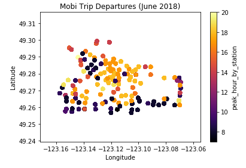
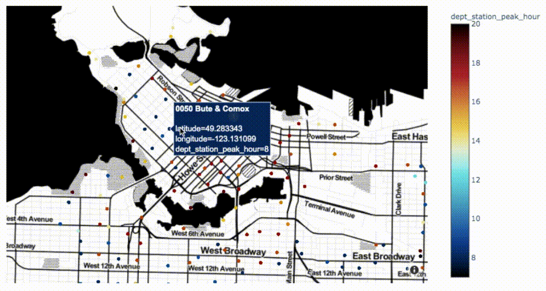

# Interactive Data Viz with Jupyter and Python  

## Exploring Interactive Data Viz with Mobi Bike Share Data 🚲

A home for my interactive data viz presentation for [UBC JupyterDay 2019](https://github.com/patrickwalls/jupyterday2019). 

</img>  </img>   
   
### Notebook & Slides

An interactive and executable version of these slides are available in a Jupyter notebook via Binder through the button below:

Source slides are in this [Jupyter notebook](https://github.com/jessimk/interactive_data_viz/blob/master/Jupyter_Interactive_Data_Viz.ipynb) and can also be viewed with [nbviewer here](https://nbviewer.jupyter.org/github/jessimk/interactive_data_viz/blob/master/Jupyter_Interactive_Data_Viz.ipynb?flush_cache=true).

### Data
Data for this presentation is a subset of [Mobi's June 2018 system data](https://www.mobibikes.ca/en/system-data). 

I've compiled and added station geolocation for the purpose of this presentation.

I've also calculated a peak trip departure hour for each station, based on June 2018 trip data. This is basically just the mode 'hour', or the most frequently occurring departure hour in the June 2018 data set per station.

The data for the presentation can be found [here](https://raw.githubusercontent.com/jessimk/interactive_data_viz/master/mobi_data_presentation_subset.csv). 

### Land Acknowledgement
I discuss geospatial context and geospatial data so I also need to acknowledge that my work explores and takes place on the unceded lands of the Musqueam, Squamish, and Tsleil-Waututh nations. 

### Thank Yous 
- [Tiffany Timbers](https://github.com/ttimbers), [Reka Solymosi](https://github.com/maczokni) for recommending Binder & other advice 🎉 

- [Patrick Walls](https://github.com/patrickwalls) for organizing JupyterDay 2019.

